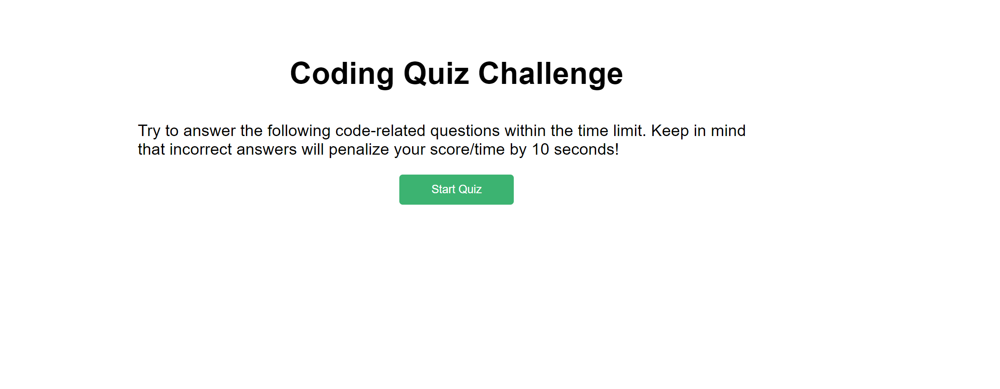

# Code-Quiz

## About

I wrote the HTML, CSS, and JavaScript for this short JavaScript Quiz. When a user gets the answer wrong, 10 seconds are taken from the timer. Their final score is equal to the time it took for them to complete the quiz, even if they answered all questions incorrectly. The quiz will also finish if the timer reaches zero.

I worked with my tutor, instructor, and a study group during the creation of this project.

## Deployed Site

The deployed site can be found here: [Code-Quiz](https://hanfernan.github.io/Code-Quiz/)
